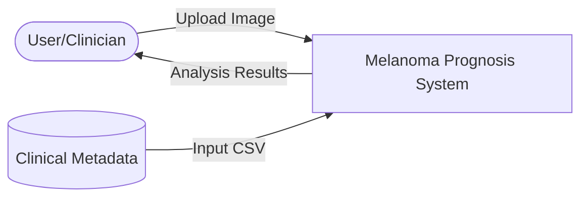
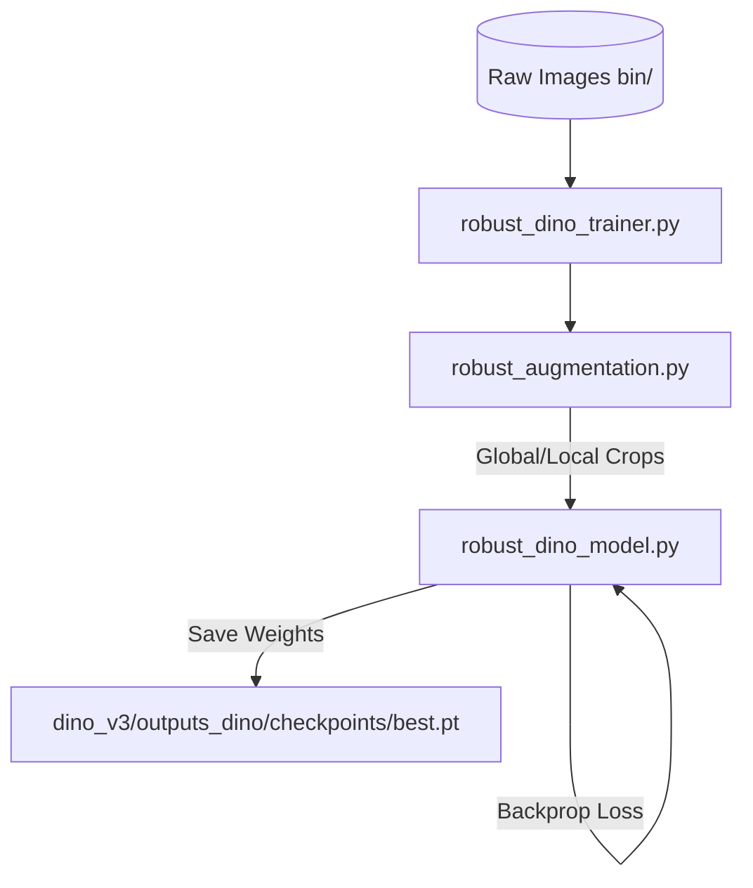
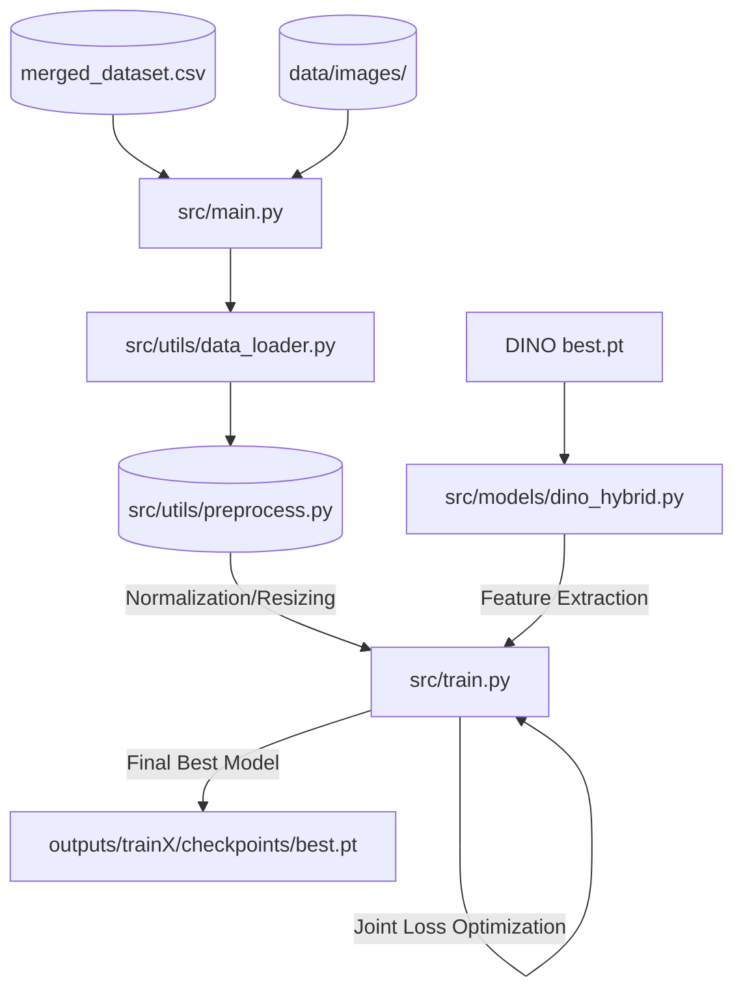
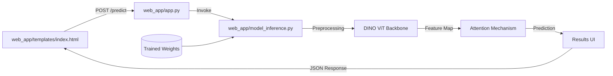

# Data Flow Diagram (DFD) - Melanoma Dermoscopic Prognosis

This document outlines the data flow across the project's components, from raw data collection to web application results.

## Level 0: Global Context Diagram
The system takes dermoscopic images and clinical metadata as input and provides malignancy classifications and Breslow thickness predictions.

---

## Level 1: System Process Detail
The system operates in three main phases: Pretraining, Training, and Inference.

### Phase 1: Self-Supervised Pretraining (DINO-v3)
The goal is to learn domain-specific visual features from unlabeled medical images.

### Phase 2: Hybrid Multitask Training
Combining learned visual features with clinical data to perform specific diagnostic tasks.

### Phase 3: Web Application Inference
Real-time analysis of user-uploaded images.

---

## File Responsibilities in Data Flow

| Process | Primary Files | Data Input | Data Output |
| :--- | :--- | :--- | :--- |
| **Ingestion** | `data_loader.py`, `preprocess.py` | CSV, JPEG/PNG | Normalized Tensors |
| **Feature Extraction** | `dino_hybrid.py`, `robust_dino_model.py` | Image Tensors | Feature Vectors (768d/1024d) |
| **Knowledge Fusion** | `fusion.py` | Image + Clinical Features | Fused Context Vector |
| **Diagnostics** | `train.py`, `evaluate.py` | Optimized Weights | Malignancy Prob, Thickness (mm) |
| **Interface** | `app.py`, `app.js` | User File Stream | Predictions & Visualizations |
